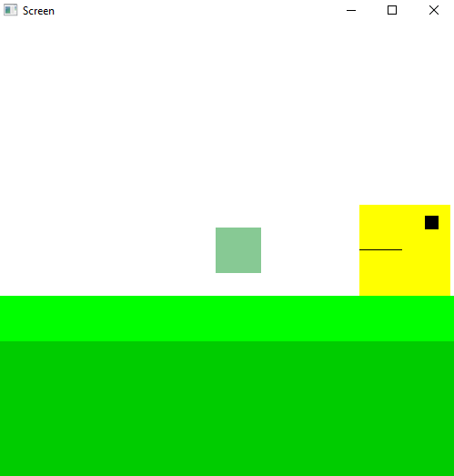
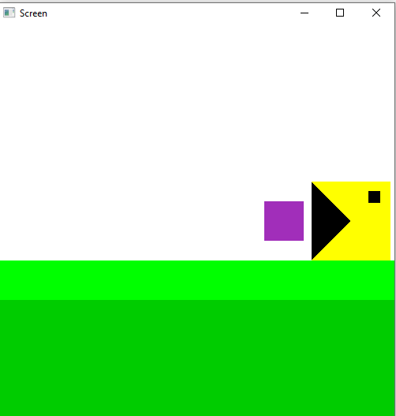

## Project Name

Pacman

## About

Project Pacman is a game that includes a simple squared pacman with triangular mouth and squared food.The aim of Pac-Man is to eat all the pills.Balls are randomly generated of different colors.When the ball encounters a mouth, it gets attracted to it.Upon reaching the surface, it follows pacman, and reaches the bottom.Moving cubes or balls are implemented.

## Features implemented

1) Balls are randomly generated of different colors

2) Mouth with triangular size

3) Ball or cube with squared size

4) Moving cube or ball

5) Moving object forward

6) Floor

7) Object to eat

8) The body,eye,mouthline,floor of a object

## Implementation output of my project 

